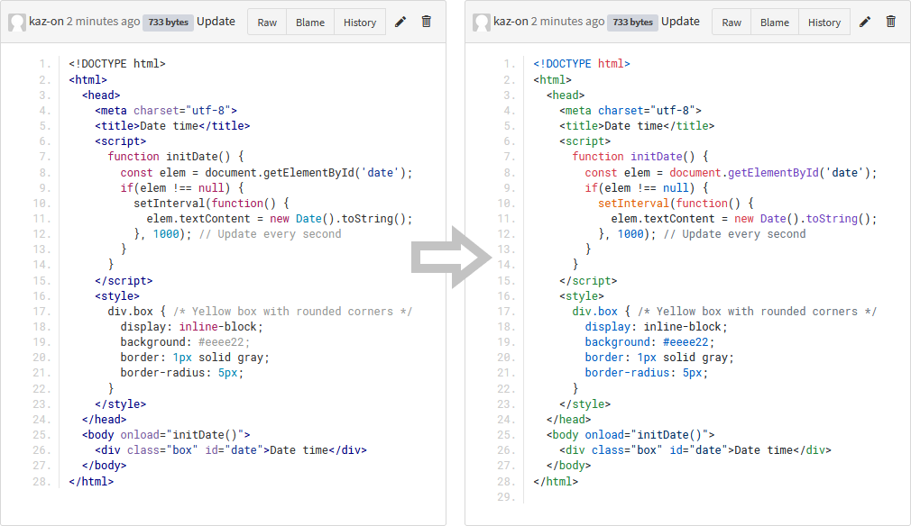

# GitBucket Code Highlighter Plugin

This is a [GitBucket](https://gitbucket.github.io/) plugin that enhances code syntax highlighting using [highlight.js](https://highlightjs.org/).

## Features

* Code syntax highlighting with automatic language detection using [highlight.js](https://highlightjs.org/).  
  Check out the [highlight.js demo](https://highlightjs.org/static/demo/) page.
* Works on repository viewer, commit diff view, and markdown code blocks.
* Language detection from file name in the repository viewer.
* All languages supported by highlight.js are available.
* All themes included in highlight.js can be selected in the account settings. (GitBucket 4.35.0 or later)  
  ⚠️ Some themes will be renamed after installing this plugin.  
  If the theme does not apply, please re-select the theme in your account settings.  
  ⚠️ The following themes will become unavailable after installing this plugin.
  - `Hemisu Dark`, `Hemisu Light`, `Vibrant Ink`

## Installation

Download jar file from the [Releases page](https://github.com/kaz-on/gitbucket-code-highlighter-plugin/releases) and put into `GITBUCKET_HOME/plugins`.

## Operating requirements

* GitBucket 4.32.0 or later
* Web browsers that support ES2020 features  
  The latest version of Chrome, Edge or Firefox is recommended.

## Build from source

1. Install Node.js, npm, sbt, and JDK
2. Clone this repository
3. Run `npm ci`
4. Run `sbt assembly`
5. Copy `target\scala-2.13\gitbucket-code-highlighter-plugin-x.x.x.jar` to `GITBUCKET_HOME/plugins`
